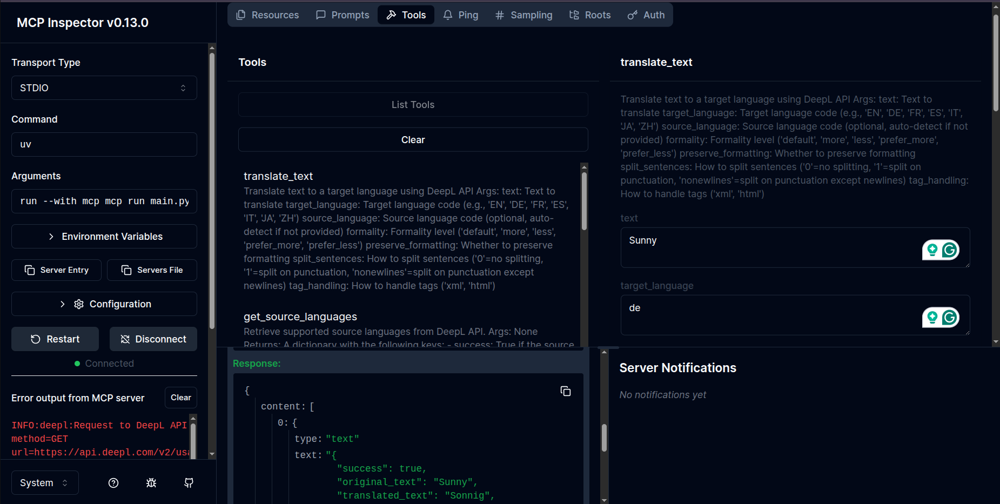
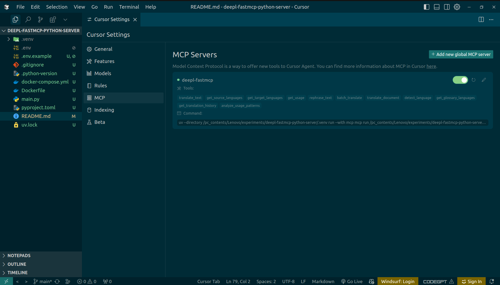

# DeepL MCP Server

A Model Context Protocol (MCP) server that provides translation capabilities using the DeepL API using python and fastmcp.

## Features

- Translate text between numerous languages
- Rephrase text using DeepL's capabilities
- Access to all DeepL API languages and features
- Automatic language detection
- Formality control for supported languages
- Batch translation and document translation
- Usage and quota reporting
- Translation history and usage analysis

---

## Installation

### Standard (Local) Installation

1. **Clone the repository:**
   ```bash
   git clone <repo-url>
   cd deepl-fastmcp-python-server
   ```

2. **Install [uv](https://github.com/astral-sh/uv?tab=readme-ov-file#installation) (recommended) or use pip:**

  With **pip**,
  
  ```bash 
  pip install uv 
  ```

  With **pipx**,
  ```bash
  pipx install uv
  ```

3. **Install dependencies:**

  ```bash
  uv sync
  ```

4. **Set your environment variables:**

Create a `.env` file or export `DEEPL_AUTH_KEY` in your shell.You can do this by running the following command and then update the `.env` file with your DeepL API key:

   ```bash
   cp .env.example .env
   ```
 
Example `.env` file:
```
DEEPL_AUTH_KEY=your_deepl_api_key
```

5. **Run the server:**

**Normal** mode:

```bash
uv run mcp run main.py
```

**Development** mode:

```bash
uv run mcp dev main.py
```

It will show some messages in the terminal like this:

      Spawned stdio transport
      Connected MCP client to backing server transport
      Created web app transport
      Set up MCP proxy
      🔍 MCP Inspector is up and running at http://127.0.0.1:6274 

MCP Inspector,




### Dockerized Installation

1. **Build the Docker image:**
   ```bash
   docker build -t deepl-fastmcp-server .
   ```

2. **Run the container:**
   ```bash
   docker run -e DEEPL_AUTH_KEY=your_deepl_api_key -p 8000:8000 deepl-fastmcp-server
   ```

### Docker Compose

1. **Create a `.env` file in the project root:**
   ```
   DEEPL_AUTH_KEY=your_deepl_api_key
   ```

2. **Start the service:**
   ```bash
   docker-compose up --build
   ```
   This will build the image and start the server, mapping port 8000 on your host to the container.

---

## Configuration

### DeepL API Key

You'll need a DeepL API key to use this server. You can get one by signing up at [DeepL API](https://www.deepl.com/pro-api?utm_source=github&utm_medium=github-mcp-server-readme). With a DeepL API Free account you can translate up to 500,000 characters/month for free.

**Required environment variables:**
- `DEEPL_AUTH_KEY` (required): Your DeepL API key.
- `DEEPL_SERVER_URL` (optional): Override the DeepL API endpoint (default: `https://api-free.deepl.com`).

---

## Usage


### Use with Cursor IDE,

Click on `File` > `Preferences` > `Cursor Settings` > `MCP` > `MCP Servers` > `Add new global MCP server`

and paste the following json:

```json
{
  "mcpServers": {
    "deepl-fastmcp": {
      "command": "uv",
      "args": [
        "--directory",
        "/path/to/yourdeepl-fastmcp-python-server/.venv",
        "run",
        "--with",
        "mcp",
        "mcp",
        "run",
        "/path/to/your/deepl-fastmcp-python-server/main.py"
      ]
    }
  }
}
```

Cursor Settings,




## Use with Claude Desktop

This MCP server integrates with Claude Desktop to provide translation capabilities directly in your conversations with Claude.

### Configuration Steps

1. Install Claude Desktop if you haven't already
2. Create or edit the Claude Desktop configuration file:

   - On macOS: `~/Library/Application Support/Claude/claude_desktop_config.json`
   - On Windows: `%AppData%\Claude\claude_desktop_config.json`
   - On Linux: `~/.config/Claude/claude_desktop_config.json`

3. Add the DeepL MCP server configuration:

```json
{
  "mcpServers": {
    "deepl-fastmcp": {
      "command": "uv",
      "args": [
        "--directory",
        "/path/to/yourdeepl-fastmcp-python-server/.venv",
        "run",
        "--with",
        "mcp",
        "mcp",
        "run",
        "/path/to/your/deepl-fastmcp-python-server/main.py"
      ]
    }
  }
}
```

---

## Available Tools

This server provides the following tools:

- `translate_text`: Translate text to a target language
- `rephrase_text`: Rephrase text in the same or different language
- `get_source_languages`: Get list of available source languages for translation
- `get_target_languages`: Get list of available target languages for translation
- `get_usage`: Check DeepL API usage and limits
- `batch_translate`: Translate multiple texts in a single request
- `translate_document`: Translate a document file using DeepL API
- `detect_language`: Detect the language of given text
- `get_glossary_languages`: Get supported language pairs for glossaries
- `get_translation_history`: Get recent translation operation history
- `analyze_usage_patterns`: Analyze translation usage patterns from history

### Tool Details

#### translate_text
Translate text between languages using the DeepL API.
- Parameters:
  - `text`: The text to translate
  - `target_language`: Target language code (e.g., 'EN', 'DE', 'FR', 'ES', 'IT', 'JA', 'ZH')
  - `source_language` (optional): Source language code
  - `formality` (optional): Controls formality level ('less', 'more', 'default', 'prefer_less', 'prefer_more')
  - `preserve_formatting` (optional): Whether to preserve formatting
  - `split_sentences` (optional): How to split sentences
  - `tag_handling` (optional): How to handle tags

#### rephrase_text
Rephrase text in the same or different language using the DeepL API.
- Parameters:
  - `text`: The text to rephrase
  - `target_language`: Language code for rephrasing
  - `formality` (optional): Desired formality level
  - `context` (optional): Additional context for better rephrasing

#### batch_translate
Translate multiple texts in a single request.
- Parameters:
  - `texts`: List of texts to translate
  - `target_language`: Target language code
  - `source_language` (optional): Source language code
  - `formality` (optional): Formality level
  - `preserve_formatting` (optional): Whether to preserve formatting

#### translate_document
Translate a document file using DeepL API.
- Parameters:
  - `file_path`: Path to the document file
  - `target_language`: Target language code
  - `output_path` (optional): Output path for translated document
  - `formality` (optional): Formality level
  - `preserve_formatting` (optional): Whether to preserve document formatting

#### detect_language
Detect the language of given text using DeepL.
- Parameters:
  - `text`: Text to analyze for language detection

#### get_source_languages
- No parameters required. See tool output for details. 
#### get_target_languages
- No parameters required. See tool output for details.
#### get_usage
- No parameters required. See tool output for details.
#### get_glossary_languages
- No parameters required. See tool output for details.
#### get_translation_history
- No parameters required. See tool output for details.
#### analyze_usage_patterns
- No parameters required. See tool output for details.


---

## Supported Languages

The DeepL API supports a wide variety of languages for translation. You can use the `get_source_languages` and `get_target_languages` tools to see all currently supported languages.

Some examples of supported languages include:

- English (en, en-US, en-GB)
- German (de)
- Spanish (es)
- French (fr)
- Italian (it)
- Japanese (ja)
- Chinese (zh)
- Portuguese (pt-BR, pt-PT)
- Russian (ru)
- And many more

---

## Debugging

For debugging information, visit the [MCP debugging documentation](https://modelcontextprotocol.io/docs/tools/debugging).

## Error Handling

If you encounter errors with the DeepL API, check the following:

- Verify your API key is correct
- Make sure you're not exceeding your API usage limits
- Confirm the language codes you're using are supported

---

## License

MIT

## Links

- [DeepL API Documentation](https://www.deepl.com/docs-api?utm_source=github&utm_medium=github-mcp-server-readme)
- [Model Context Protocol Documentation](https://modelcontextprotocol.io/docs/)
